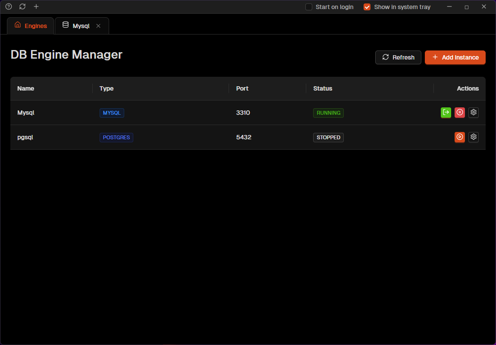
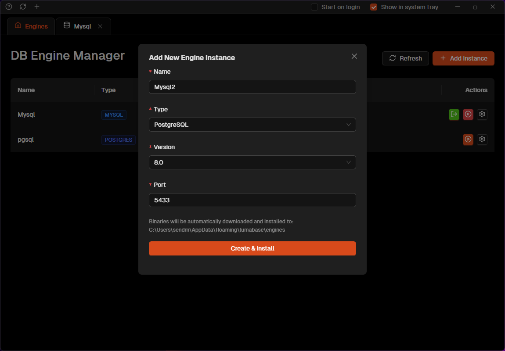
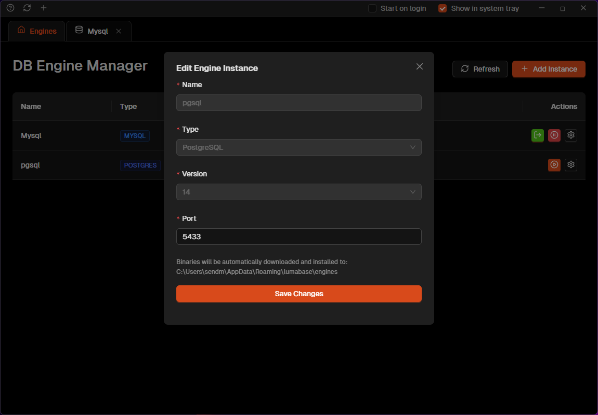
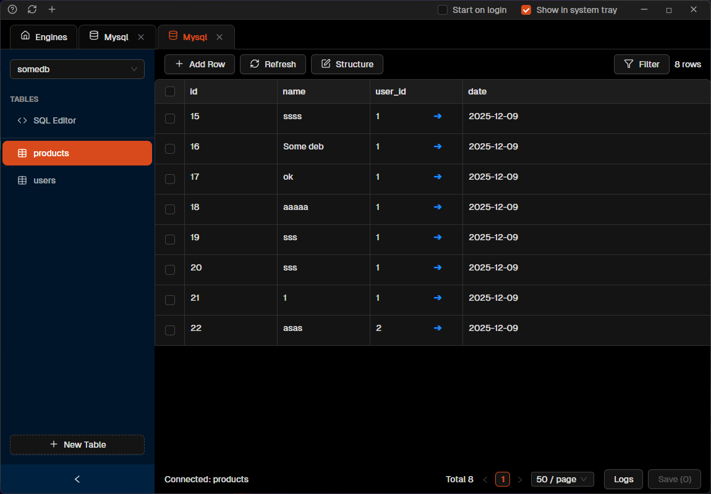
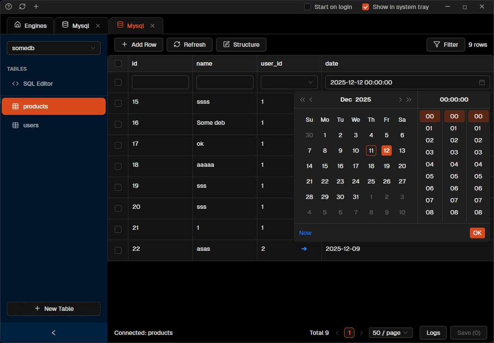
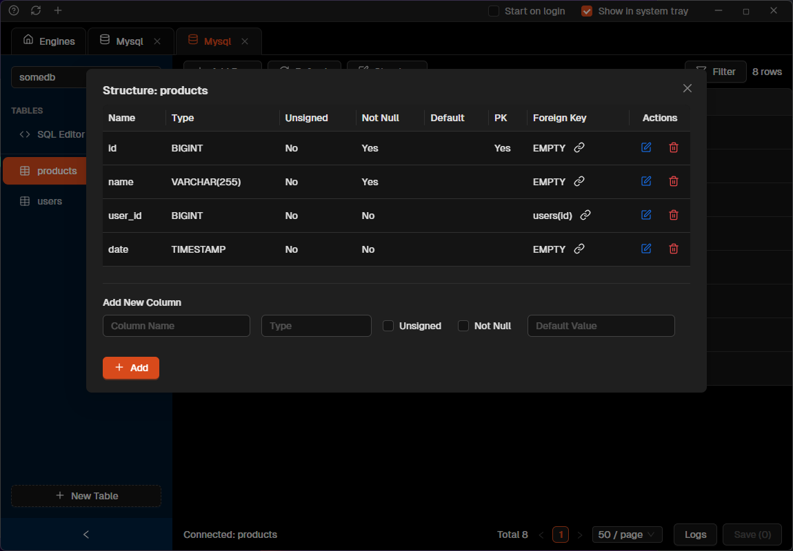
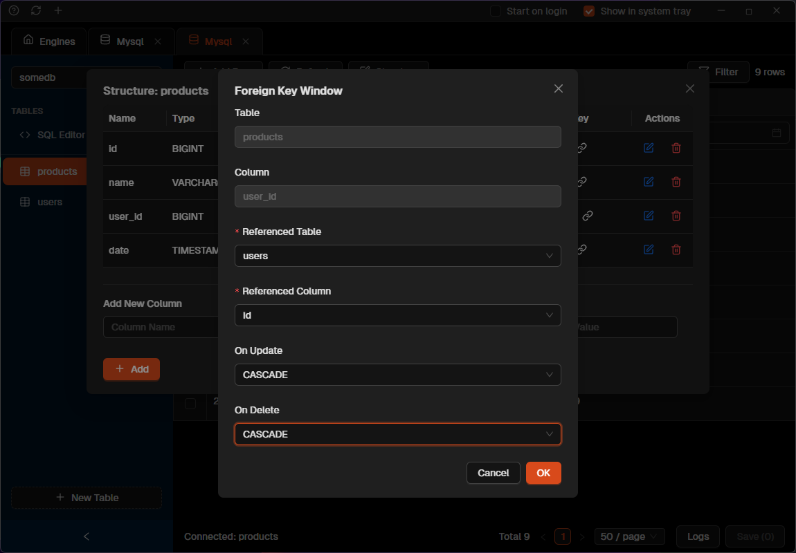
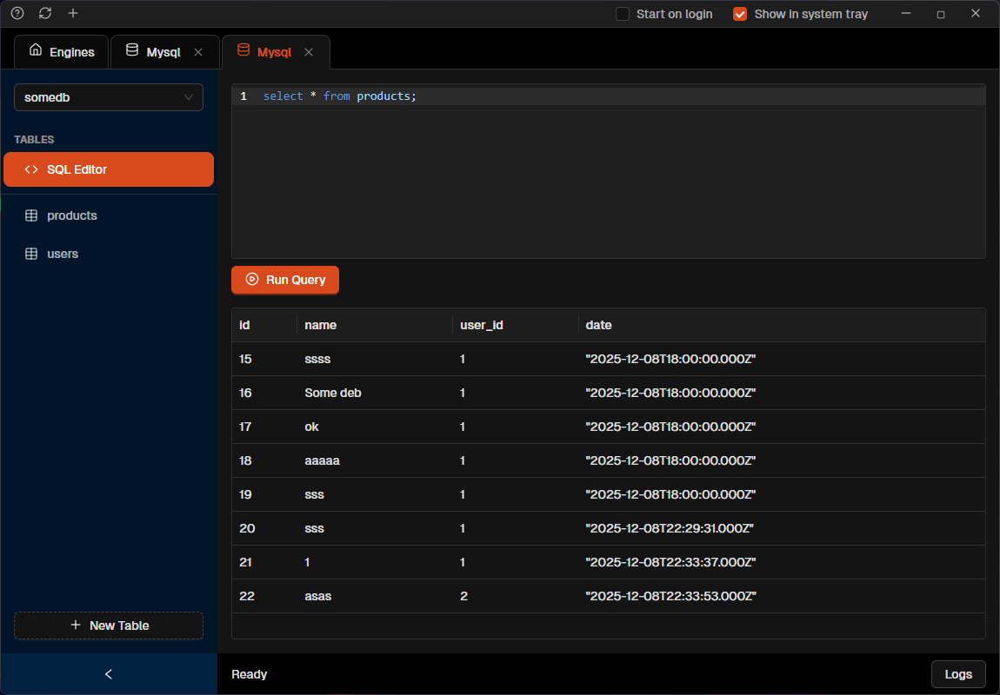

# Lumabase


**Lumabase** is a modern, cross-platform database management tool designed for speed and efficiency. Built with Electron, React, and Ant Design, it provides a seamless experience for managing MySQL and PostgreSQL databases.

---

## ✨ Features

- 🏗️ **Database Engine Manager**: Automatically download, install, and manage local MySQL and PostgreSQL instances directly within the app.
- 🔌 **Multi-Database Support**: Connect effortlessly to MySQL and PostgreSQL.
- 📊 **Table Explorer**: View and edit data with a powerful, specialized Ant Design Table interface.
- 🛠️ **Structure Editor**: Visually modify table schemas, manage columns, and data types.
- 🔗 **Foreign Key Manager**: Intuitive visual editor for managing foreign key constraints.
- 📝 **SQL Editor**: Execute queries with a full-featured code editor (CodeMirror) supporting syntax highlighting and auto-completion.
- 💾 **Batch Editing**: Make multiple changes and save them in a single transaction.
- 🖥️ **Custom UI**: Frameless window with a custom designed title bar, context-aware refresh, and dark-themed interface.

## 📸 Screenshots

### Database Manager
Manage multiple database instances and connection configurations in one place.


### Add New Engine
Easily download and setup new database engines.


### Edit Engine Configuration
Configure port and data directories for your local database instances.


### Table Explorer
Navigate through your tables and view data with ease.


### Modern Data Editor
Edit data inline with a powerful, modern interface.


### Structure Editor
Visually modify table schemas and column definitions.


### Foreign Key Management
Intuitively manage relationships between tables.


### Built-in SQL Editor
Execute queries directly with syntax highlighting and auto-completion.


## 🛠️ Tech Stack

- **Runtime**: [Electron](https://www.electronjs.org/)
- **Frontend**: [React](https://reactjs.org/), [Vite](https://vitejs.dev/)
- **UI Library**: [Ant Design](https://ant.design/)
- **Code Editor**: [CodeMirror](https://uiwjs.github.io/react-codemirror/)
- **Language**: [TypeScript](https://www.typescriptlang.org/)

## 📂 File Structure

<details>
<summary>Click to expand project structure</summary>

```
Lumabase/
├── electron/                   # Main process (Node.js)
│   ├── main.ts                 # App entry point & IPC handlers
│   └── preload.ts              # Secure IPC bridge
├── src/                        # Renderer process (React)
│   ├── components/             # Reusable UI Components
│   ├── hooks/                  # Custom hooks (Logic)
│   ├── renderer/               # IPC wrappers
│   ├── screens/                # UI Components & Screens
│   ├── server/                 # Database Adapters (Backend Logic)
│   ├── styles/                 # Global CSS
│   └── utils/                  # Helpers
├── package.json
└── vite.config.ts
```
</details>

## 🚀 Getting Started

### Prerequisites

- Node.js (v16+)
- npm or yarn

### Installation

1.  **Clone the repository**
    ```bash
    git clone https://github.com/arifurrahmanns/Lumabase.git
    cd Lumabase
    ```

2.  **Install dependencies**
    ```bash
    npm install
    ```

### 🏃‍♂️ Running Locally

Start the development server with hot-reload:

```bash
npm run dev
```

### 📦 Building for Production

Build the application for your operating system:

```bash
npm run build
```

## 🤝 Contributing

Check out the [Developer Guide](DEVELOPMENT.md) for details on the architecture and how to add new database adapters.

## 📄 License

MIT
